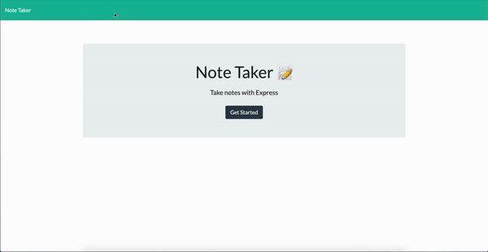

# 09-Note-Taker

# DEMO 

# Description 
This application is used to write, save, and delete notes. This application uses an express backend to save and retrieve note data from a JSON file.

This was done using Node.js utilizing: 
- express
- fs 
- bodyparser 
